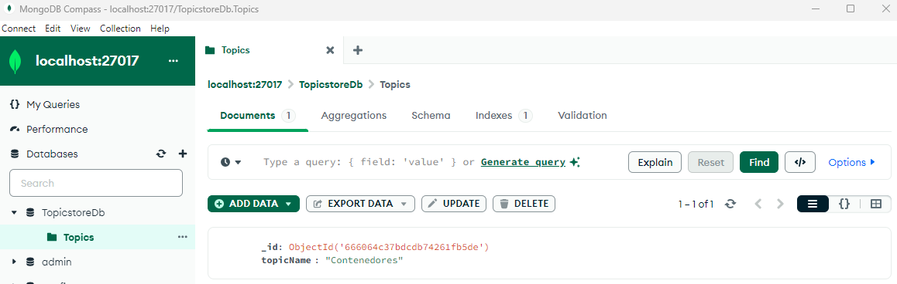
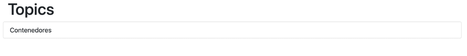

## Ejercicio 1

Dockeriza la aplicación dentro de [lemoncode-challenge](./), la cual está compuesta de 3 partes:

- Un front-end con Node.js
- Un backend en .NET (`dotnet-stack`) o en Node.js (`node-stack`) que utiliza un MongoDB para almacenar la información.
- El MongoDB donde se almacena la información en una base de datos.

Nota: como has podido comprobar, el directorio `lemoncode-challenge` tiene dos carpetas: `dotnet-stack` y `node-stack`. En ambos casos el frontend es el mismo, sólo cambia el backend. Usa el stack que prefieras.

### Requisitos del ejercicio

1. Los tres componentes deben estar en una red llamada `lemoncode-challenge`.
2. El backend debe comunicarse con el mongodb a través de esta URL `mongodb://some-mongo:27017`.
3. El front-end debe comunicarse con la api a través de `http://topics-api:5000/api/topics`.
4. El front-end debe estar mapeado con el host para ser accesible a través del puerto 8080.
5. El MongoDB debe almacenar la información que va generando en un volumen, mapeado a la ruta `/data/db`.
6. Este debe de tener una base de datos llamada `TopicstoreDb` con una colección llamada `Topics`. La colección `Topics` debe tener esta estructura:

```json
{
  "_id": { "$oid" : "5fa2ca6abe7a379ec4234883" },
  "topicName" : "Contenedores"
}
```

¡Añade varios registros!

__Tip para backend__: Antes de intentar contenerizar y llevar a cabo todos los pasos del ejercicio se recomienda intentar ejecutar la aplicación sin hacer cambios en ella. En este caso, lo único que es posible que “no tengamos a mano” es el MongoDB. Por lo que empieza por crear este en Docker, usa un cliente como el que vimos en el primer día de clase (MongoDB Compass) para añadir datos que pueda devolver la API.



Nota: es más fácil si abres Visual Studio Code desde la carpeta `backend` para hacer las pruebas y las modificaciones que si te abres desde la raíz del repo. Para ejecutar este código solo debes lanzar `dotnet run` si usas el stack de .NET, o `npm install && npm start` si usas el stack de Node.js.

__Tip para frontend__: Para ejecutar el frontend abre esta carpeta en VS Code y ejecuta primero `npm install`. Una vez instaladas las dependencias ya puedes ejecutarla con `npm start`. Debería de abrirse un navegador con lo siguiente:




## Solución de Ejercicio 1

1. Crear Networkd

```powershell
docker network create lemoncode-challenge
docker network ls
docker network inspect lemoncode-challenge    
```

2. Crear contenedor de mongo 

```shell
#Crear volumen de mongo
docker run --name some-mongo --mount type=volume,source=mongo,target=/data/db -p 27017:27017 -d --network lemoncode-challenge  mongo

docker exec -it some-mongo /bin/bash                                                                                                
root@11acd20a7771:/# ls /data/db

docker volume ls
```

3. Crear imagen de Api.
He añadido [.dockerignore](./lemoncode-challenge/dotnet-stack/backend/.dockerignore) y dejo el link a [Dockerfile](./lemoncode-challenge/dotnet-stack/backend/Dockerfile)
He puesto varias formas de crear el contenedor, fue un poco iterando y probando. La opción tres sería la buena

```shell
# Dirección del docker file del backend
 cd .\02-contenedores\lemoncode-challenge\dotnet-stack\backend\
 
# Opcion Api 1
docker build -t topics-api:1.0.0 .
docker run --name topics-api -d -p 5000:80 --network lemoncode-challenge  topics-api:1.0.0 

#Opcion Api 2
docker build --build-arg CONNECTION_STRING="://some-mongo:27017" -t topics-api:1.0.0 .
docker run --name topics-api -d -p 5000:80 --network lemoncode-challenge  topics-api:1.0.0 

#Opcion Api 3
docker build -t topics-api:1.0.0 .
docker run -e TopicstoreDatabaseSettings__ConnectionString="mongodb://some-mongo:27017" --name topics-api -d -p 5000:80 --network  lemoncode-challenge  topics-api:1.0.0 

```

3. Crear imagen de front.
He añadido [.dockerignore](./lemoncode-challenge/dotnet-stack/frontend/.dockerignore) y dejo el link a [Dockerfile](./lemoncode-challenge/dotnet-stack/frontend/Dockerfile)
He puesto varias formas de crear el contenedor, fue un poco iterando y probando. La opción tres sería la buena

```shell
# Dirección del docker file del frontend
cd .\02-contenedores\lemoncode-challenge\dotnet-stack\frontend\

#Opcion Frontend 1
docker build -t topics-frontend:1.0.0 .
docker run --name topics-frontend -d -p 8080:3000 --network lemoncode-challenge  topics-frontend:1.0.0

#Opcion Frontend  2
docker build --build-arg TOPICS_API=topics-api -t topics-frontend:1.0.0 .
docker run --name topics-frontend -d -p 8080:3000 --network lemoncode-challenge  topics-frontend:1.0.0

#Opcion Frontend 3
docker build -t topics-frontend:1.0.0 .
docker run --name topics-frontend -e API_URI=http://topics-api -d -p 8080:3000 --network lemoncode-challenge  topics-frontend:1.0.0
```