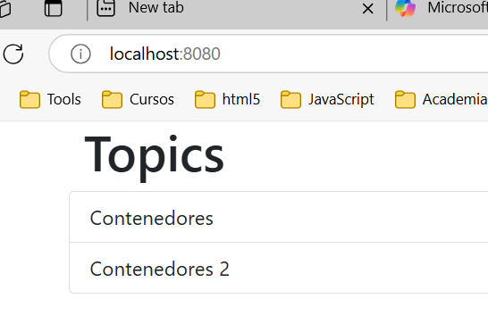

## Ejercicio 2
Ahora que ya tienes la aplicación del ejercicio 1 dockerizada, utiliza Docker Compose para lanzar todas las piezas a través de este. Debes plasmar todo lo necesario para que esta funcione como se espera: la red que utilizan, el volumen que necesita MongoDB, las variables de entorno, el puerto que expone la web y la API. Además debes indicar qué comandos utilizarías para levantar el entorno, pararlo y eliminarlo.


## Solución de Ejercicio 1

Link al docker compose: [docker-compose.yml](./lemoncode-challenge/docker-compose.yml)
He creado un [script](./lemoncode-challenge/docker-entrypoint-initdb.d/init-mongo.js) que inicializa la base de datos.

```shell
cd .\02-contenedores\lemoncode-challenge\

# levantar el entorno
docker compose up
# levantar el entorno y no hacer un attach
docker compose up -d
[+] Running 5/5
 ✔ Network lemoncode-challenge_lemoncode-challenge  Created                                                        0.1s
 ✔ Volume "lemoncode-challenge_mongo"               Created                                                        0.0s
 ✔ Container lemoncode-challenge-some-mongo-1       Started                                                        1.0s
 ✔ Container lemoncode-challenge-frontend-api-1     Started                                                        1.0s
 ✔ Container lemoncode-challenge-topics-api-1       Started                                                        1.2s
# Parar el entorno
docker compose stop
# Parar y eliminar el entorno 
docker compose down
# Parar y eliminar el entorno con volumen
 docker compose down -v
[+] Running 5/5
 ✔ Container lemoncode-challenge-frontend-api-1     Removed                                                                                            1.4s
 ✔ Container lemoncode-challenge-topics-api-1       Removed                                                                                            0.7s
 ✔ Container lemoncode-challenge-some-mongo-1       Removed                                                                                            0.9s
 ✔ Volume lemoncode-challenge_mongo                 Removed                                                                                            0.0s
 ✔ Network lemoncode-challenge_lemoncode-challenge  Removed                       
```
- Adjunto captura de pantalla donde se puede ver la aplicación arrancada:


- Comprobamos que están todos los contenedores levantado y que sólo se expone el frontend:
```shell
 docker compose ps
NAME                                 IMAGE                              COMMAND                  SERVICE        CREATED         STATUS         PORTS
lemoncode-challenge-frontend-api-1   lemoncode-challenge-frontend-api   "docker-entrypoint.s…"   frontend-api   3 minutes ago   Up 3 minutes   0.0.0.0:8080->3000/tcp
lemoncode-challenge-some-mongo-1     mongo:latest                       "docker-entrypoint.s…"   some-mongo     3 minutes ago   Up 3 minutes   27017/tcp
lemoncode-challenge-topics-api-1     lemoncode-challenge-topics-api     "dotnet backend.dll"     topics-api     3 minutes ago   Up 3 minutes   80/tcp
```