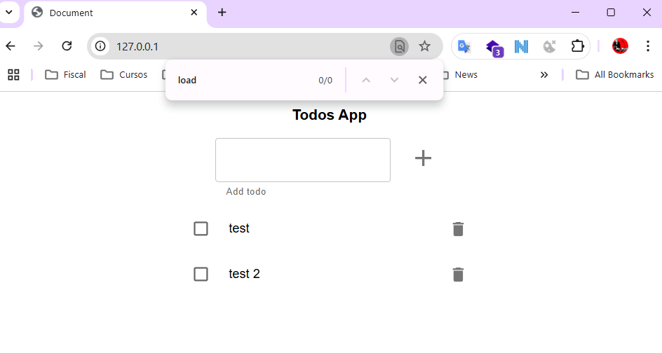

# Monolito en memoria

## Enunciado

Construir los distintos recursos de Kubernetes para generar un clúster, como el de la siguiente imagen:


### Para ello seguir los siguientes pasos:

### Paso 1. Crear todo-app

Crear un `Deployment` para `todo-app`, usar el `Dockerfile` de este direetorio **todo-app**, para generar la imagen necesaria.

> Nota: Se puede usar la imagen `lemoncodersbc/lc-todo-monolith:v5-2024`

Al ejecutar un contenedor a partir de la imagen anaterior, el puerto por defecto es el 3000, pero se lo podemos alimentar a partir de  variables de entorono, las variables de entorno serían las siguientes

* **NODE_ENV** : El entorno en que se está ejecutando el contenedor, nos vale cualquier valor que no sea `test`
* **PORT** : El puerto por el que va a escuchar el contenedor.

### Paso 2. Acceder a todo-app desde fuera del clúster

Crear un `LoadBalancer service` para acceder al `Deployment` anteriormente creado desde fuera del clúster. Para poder utilizar un `LoadBalancer` con minikube seguir las instrucciones de este [artículo](https://minikube.sigs.k8s.io/docs/handbook/accessing/)


## Solución

1. Crear deployment, definido en el siguiente archivo: [deploy-todo-app.yaml](deploy-todo-app.yaml)
2. Aplicar el deployment.
```shell
> kubectl apply -f .\deploy-todo-app.yaml
deployment.apps/todo-app created
```
3. Crear el servicio: [svc-todo-app.yaml](svc-todo-app.yaml)
4. Aplicar el servicio
```shell
>  kubectl apply -f .\svc-todo-app.yaml
service/todo-app created
```
También se puede lanzar este comando: ``kubectl apply -f .`` sobre el directorio para crear todos los recursos de golpe.

5. Abrir el tunnel para conectarse a minikube para un servicio de tipo LoadBalancer
```powershell
> minikube tunnel
```
6. Abrir el navegador en la ruta `127.0.0.1` o hacer un `curl` a `127.0.0.1`



También podemos hacer un curl para verificar que la aplicación nos responde.
```powershell
 curl  http://127.0.0.1
```
---

### Notas

Dejo una serie de comandos a modo de referencia, los cuales he ejecutado para verificar que los recursos de Kubernetes se creaban correctamente.

```shell
# Reviso el log del contenedor.
> kubectl logs todo-app-688cff8767-bkbf6
execute
Server running on port 3001

# Reviso las variables de entorno que hemos creado
> kubectl exec -it todo-app-688cff8767-bkbf6 -- /bin/sh
/app # env
KUBERNETES_PORT=tcp://10.96.0.1:443
KUBERNETES_SERVICE_PORT=443
NODE_VERSION=22.11.0
HOSTNAME=todo-app-688cff8767-bkbf6
YARN_VERSION=1.22.22
SHLVL=1
PORT=3001

# Verifico que se puede hacer un curl a la aplicación.
> curl  http://127.0.0.1

StatusCode        : 200
StatusDescription : OK
Content           : <!doctype html><html lang="en"><head><meta charset="UTF-8"><meta name="viewport" content="width=device-width,initial-scale=1"><title>Document</title><script                    
                  
RawContent        : HTTP/1.1 200 OK

# Verificos servicios, endpoint, pods...
> kubectl get svc
NAME         TYPE           CLUSTER-IP   EXTERNAL-IP   PORT(S)        AGE
kubernetes   ClusterIP      10.96.0.1    <none>        443/TCP        5h43m
todo-app     LoadBalancer   10.96.59.4   <pending>     80:31399/TCP   15s

> kubectl get endpoints
NAME         ENDPOINTS           AGE
kubernetes   192.168.49.2:8443   5h45m
todo-app     10.244.0.5:3001     104s

> kubectl get pods -o wide
NAME                        READY   STATUS    RESTARTS      AGE     IP           NODE       NOMINATED NODE   READINESS GATES
todo-app-688cff8767-bkbf6   1/1     Running   1 (12m ago)   5h14m   10.244.0.5   minikube   <none>           <none>

#Después de abrir el tunnel, se asigna la ip a external-ip
> kubectl get svc
NAME         TYPE           CLUSTER-IP   EXTERNAL-IP   PORT(S)        AGE
kubernetes   ClusterIP      10.96.0.1    <none>        443/TCP        5h49m
todo-app     LoadBalancer   10.96.59.4   127.0.0.1     80:31399/TCP   6m9s
```

Borrar los servicios creados
```powershell
kubectl delete -f .

# o también.
kubectl delete deploy todo-app
kubectl delete svc todo-app
```