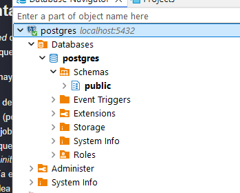
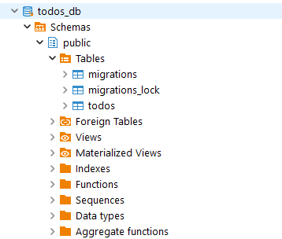

# Monolito

## Enunciado

Construir los distintos recursos de Kubernetes para generar un clúster, como el de la siguiente imagen:


### Para ello seguir los siguientes pasos:

### Paso 1. Crear una capa de persistencia de datos

Crear un `StatefulSet` para tener una base de datos dentro del cluster, para ello generar los siguientes recursos: 

* Crear un `ConfigMap` con la configuración necesaria de base de datos
* Crear un `StorageClass` para el aprovisionamineto dinámico de los recursos de persistencia
* Crear un `PersistentVolume` que referencie el `StorageClass` anterior
* Crear un `PersistentVolumeClaim` que referencie el `StorageClass` anterior
* Crear un `Cluster IP service`, de esta manera los pods del `Deployment` anterior serán capaces de llegar al `StatefulSet`
* Crear el `StatefulSet` alimentando las variables de entorno y el volumen haciendo referencia al `PersistentVolumeClaim` creado anteriormente.

> **Nota**: Para la BBDD podéis usar la imagen `lemoncodersbc/lc-todo-monolith-psql:v5-2024`. ¿Qué tiene esa imagen? Se trata de una imagen que hereda de `postgres` pero añade el fichero `todos_db.sql` como script de inicio (ver fichero `./todo-app/Dockerfile.todos_db`)

Una vez tengamos nuestro `StatefulSet` corriendo la manera más directa de generar la base de datos sería (seed de datos):

* Ejecutamos `kubectl get pods`, y obtenemos el nombre del pod relacionado con el `StatefulSet`.
* Ejecutamos `kubectl exec [postgres-pod-name] -it bash`
* Ejecutamos `psql -U postgres`, pegamos `todo-app/todos_db.sql` y pulsamos `enter`, la base de datos debería estar generada

> **Nota**: Estos pass no deberían ser necesarios si habeís usado la imagen `lemoncodersbc/lc-todo-monolith-psql:v5-2024` en el StatefulSet

### Paso 2. Crear todo-app

Crear un `Deployment` para `todo-app`, usar el `Dockerfile` de este direetorio **todo-app**, para generar la imagen necesaria.

> Nota: Podéis usar la imagen `lemoncodersbc/lc-todo-monolith-db:v5-2024`

Al ejecutar un contenedor a partir de la imagen anaterior, el puerto por defecto es el 3000, pero se lo podemos alimentar a partir de  variables de entorono, las variables de entorno serían las siguientes

* **NODE_ENV** : El entorno en que se está ejecutando el contenedor, nos vale cualquier valor que no sea `test`
* **PORT** : El puerto por el que va a escuchar el contenedor
* **DB_HOST** : El host donde se encuentra la base de datos
* **DB_USER**: El usuario que accede a la base de datos, podemos usar el de por defecto `postgres`
* **DB_PASSWORD**: El password para acceeder a la base de datos, podemos usar el de por defecto `postgres`
* **DB_PORT** : El puerto en el que postgres escucha `5432`
* **DB_NAME** : El nombre de la base de datos, en `todo-app/todos_db.sql`, el script de inicialización recibe el nombre de `todos_db`
* **DB_VERSION** : La versión de postgres a usar, en este caso `10.4`

Crear un `ConfigMap` con todas las variables de entorno, que necesitarán los pods de este `Deployment`.

> NOTA: Las obligatorias son las de la base de datos, todas aquellas que comienzan por `DB`

### Paso 3. Acceder a todo-app desde fuera del clúster

Crear un `LoadBalancer service` para acceder al `Deployment` anteriormente creado desde fuera del clúster. Para poder utilizar un `LoadBalancer` con minikube seguir las instrucciones de este [artículo](https://minikube.sigs.k8s.io/docs/handbook/accessing/)

## Comentarios

Hacer un _seed_ de datos de una BBDD es una tarea muchas veces necesarias. Usar una imagen "cocinada" no es, ni de lejos, la mejor de las opciones ya que **implica generar la imagen cada vez que el sql del seed se modifica** lo que no es muy correcto.

En su lugar, hay varias alternativas que podríamos usar:

1. En lugar de usar una imagen "cocinada" que es idéntica a la original pero con un fichero añadido podríamos pasar este fichero a través de un volumen (poner el fichero en un ConfigMap y montar el ConfigMap en el contenedor).
2. Usar un job de Kubernetes que ejecutase el script. Este job podría ejecutar un contenedor que usase el cliente de la bbdd (psql en nuestro caso) y que lanzase el script contra la bbdd. El script se lo pasaríamos mediante un volumen usando un ConfigMap.
3. Usar un _init container_ en el cliente (**no en la base de datos**). No podemos usar un _init container_ en el pod de la bbdd porque cuando se ejecutaría este _init container_ no se estaría ejecutando la bbdd. No obstante usar un _init container_ en el cliente (el pod de la app) no es una buena idea por dos motivos: el primero es que si el cliente se levanta antes que la bbdd,  el _init container_ no se podrá ejecutar, dará error y el pod quedará en `Init:Error`. El segundo es que este _init container_ se ejecutaría cada vez que se crease el pod de la app (si se escala horizontalmente cada pod tendrá su propio _init container_), por  lo que el script debe estar preparado para poder ser ejecutado N veces en paralelo y ser idempotente (lo que añade una complejidad inecesaria).

## Solución
Para el seed de datos, he optado por crear un job que ejecute un script el cual es montado desde un volumen a través de un configMap.
1. Creo el configMap para el seed datos
```powershell
> cd .\Exercise-2\ss-db\migrations\

> kubectl create cm cm-db-migration --from-file .\todos_db.sql -o yaml > cm-db-migration.yaml
#Comprobamos el configmap
> kubectl get cm
NAME               DATA   AGE
cm-db-migration    1      38s
kube-root-ca.crt   1      9m20s
```

2. Creamos el statefulSet de la base de datos con todos sus recursos necesarios:
- [cm-todo-db.yaml](./ss-db/cm-todo-db.yaml). Configuración de base datos, usuario y contraseña.
- [pv-todo-db.yaml](./ss-db/pv-todo-db.yaml). Creamos el `PersistentVolume`
- [pvc-todo-db.yaml](./ss-db/pvc-todo-db.yaml). Creamos el `PersistentVolumeClaim`
- [scn-todo-db.yaml](./ss-db/scn-todo-db.yaml). Creamos el `storageClass` para el volumen persistente.
- [ss-todo-db.yaml](./ss-db/ss-todo-db.yaml). Creamos el `StatefulSet`, se configura el volumen para que utilice la `StorageClass` anteriormente creada. 
- [svc-todo-db.yaml](./ss-db/svc-todo-db.yaml). Creamos el servicio para poder conectarnos posteriormente desde la aplicación

```powershell
# subimos un nivel
> cd ..
# Aplicamos los cambios.
>kubectl apply -f .
configmap/cm-todo-db created
persistentvolume/pv-todo-db created
persistentvolumeclaim/pvc-todo-db created
storageclass.storage.k8s.io/scn-todo-db created
statefulset.apps/ss-todo-db created
service/svc-todo-db created
```
El pod del statefulSet tarde un minuto en estar disponible.

Reviso un poco todas las configuraciones.
````powershell
> kubectl get statefulset
 NAME         READY   AGE
 ss-todo-db   1/1     107s

> kubectl get svc -o wide
NAME          TYPE        CLUSTER-IP     EXTERNAL-IP   PORT(S)    AGE     SELECTOR
kubernetes    ClusterIP   10.96.0.1      <none>        443/TCP    26m     <none>
svc-todo-db   ClusterIP   10.98.100.22   <none>        5432/TCP   2m38s   app=ss-todo-db

> kubectl get pods -o wide --show-labels
 NAME           READY   STATUS    RESTARTS   AGE     IP           NODE       NOMINATED NODE   READINESS GATES   LABELS
 ss-todo-db-0   1/1     Running   0          3m29s   10.244.0.6   minikube   <none>           <none>            app=ss-todo-db

> kubectl get cm
NAME               DATA   AGE
cm-db-migration    1      16m
cm-todo-db         2      64s
kube-root-ca.crt   1      25m

> kubectl get pv
NAME                                       CAPACITY   ACCESS MODES   RECLAIM POLICY   STATUS   CLAIM                                STORAGECLASS   VOLUMEATTRIBUTESCLASS   REASON   AGE
pv-todo-db                                 10Gi       RWO            Retain           Bound    default/pvc-todo-db                  scn-todo-db    <unset>                          72s
pvc-05b8bd74-f322-40f9-a223-1e335068d165   10Gi       RWO            Delete           Bound    default/postgres-data-ss-todo-db-0   scn-todo-db    <unset>                          72s

> kubectl get pvc
NAME                         STATUS   VOLUME                                     CAPACITY   ACCESS MODES   STORAGECLASS   VOLUMEATTRIBUTESCLASS   AGE
postgres-data-ss-todo-db-0   Bound    pvc-05b8bd74-f322-40f9-a223-1e335068d165   10Gi       RWO            scn-todo-db    <unset>                 85s
pvc-todo-db                  Bound    pv-todo-db                                 10Gi       RWO            scn-todo-db    <unset>                 85s
````


3. Pruebo la conexión a la base de datos a traves de un `port-forward`
```powershell
 kubectl port-forward ss-todo-db-0 5432:5432
 Forwarding from 127.0.0.1:5432 -> 5432
 Forwarding from [::1]:5432 -> 5432
```
Uso el cliente de Dveaver



Pruebo a conectarme desde la consola también:
```powershell
 kubectl exec -it ss-todo-db-0 -- /bin/sh
# psql -U postgres
psql (16.6 (Debian 16.6-1.pgdg120+1))
Type "help" for help.

postgres=#
```

4. Ejecutamos el job
```powershell
cd .\Exercise-2\ss-db\migrations\
# Ejecutamos el jobs
 kubectl apply -f .\job-db-migration.yaml
# Hacemos un port-forward para ver que la actualización se realiza.
kubectl port-forward ss-todo-db-0 5432:5432
```

Probamos la conexión a la base de datos con el cliente de Dveaver


Probramos la conexión desde la consola.
```shell
 kubectl exec -it ss-todo-db-0 -- /bin/sh
 # Contenedor del pod:
  psql -U postgres -d todos_db
psql (16.6 (Debian 16.6-1.pgdg120+1))
Type "help" for help.

todos_db=# SELECT * FROM public.todos;
 id |     title     | completed |          due_date          | order
----+---------------+-----------+----------------------------+-------
 12 | Learn Jenkins | f         | 2020-12-04 18:37:44.234+00 |
 13 | Learn GitLab  | t         | 2020-12-04 18:38:06.993+00 |
 21 | Learn K8s     | f         | 2020-12-04 19:12:16.174+00 |
(3 rows)
```