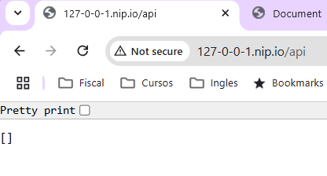
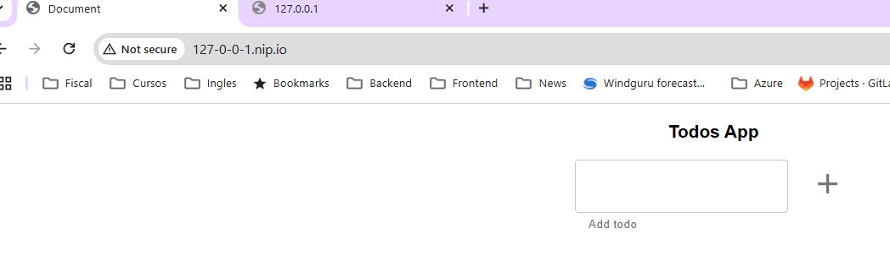

# Ingress

## Enunciado

Construir los distintos recursos de Kubernetes para generar un clúster, como el de la siguiente imagen:


### Para ello seguir los siguientes pasos:

### Paso 1. Crear todo-front.

Crear un `Deployment` para `todo-front`, usar el `Dockerfile` de este directorio **02-distributed/todo-front**, para generar la imagen necesaria. Notar que existe `ARG API_HOST` dentro del fichero `Dockerfile`, lo podemos omitir en este caso, sólo está ahí para poder probar el contenedor de Docker en local.

> **Nota**: Puedes usar la imagen `lemoncodersbc/lc-todo-front:v5-2024`

Al ejecutar un contenedor a partir de la imagen anterior, el puerto expuesto para http es el 80. 

Crear un `Cluster IP Service` que exponga `todo-front` dentro del clúster.

### Paso 2. Crear todo-api.

Crear un `Deployment` para `todo-api`, usar el `Dockerfile` de este directorio **02-distributed/todo-api**, para generar la imagen necesaria.

> **Nota**: Podéis usar la imagen `lemoncodersbc/lc-todo-api:v5-2024`

Al ejecutar un contenedor a partir de la imagen anaterior, el puerto por defecto es el 3000, pero se lo podemos alimentar a partir de  variables de entorono, las variables de entorno serían las siguientes

* **NODE_ENV** : El entorno en que se está ejecutando el contenedor, nos vale cualquier valor que no sea `test`
* **PORT** : El puerto por el que va a escuchar el contenedor

(_Opcional_) Crear un `ConfigMap` que exponga las variables de entorno anteriores. 

Crear un `Cluster IP Service` que exponga `todo-api` dentro del clúster.

### Paso 3. Crear un Ingress para acceder a los servicios del clúster

Crear un `Ingress` para exponer los servicios anteriormente creados. Como referencia para crear este controlardor con `minikube` tomar como referencia el siguiente ejemplo [Set up Ingress on Minikube with the NGINX Ingress Controller](https://kubernetes.io/docs/tasks/access-application-cluster/ingress-minikube/)


# Solución

En la carpeta lc-todo están creados los recursos de kubernetes:
 - Deployment de ``todo-api``: [deploy-lc-todo-api.yaml](./lc-todo/deploy-lc-todo-api.yaml)
 - Config map utilizado por ``todo-api`` para obtener los valores de configuración: [cm-lc-todo-api.yaml](./lc-todo/cm-lc-todo-api.yaml)
 - Deployment de ``todo-front``: [deploy-lc-todo-front.yaml](./lc-todo/deploy-lc-todo-front.yaml)
 - Servicio de ``Cluster IP`` para ``todo-api``: [svc-lc-todo-api.yaml](./lc-todo/svc-lc-todo-api.yaml)
 - Servicio de ``Cluster IP`` para ``todo-front``: [svc-lc-todo-front.yaml](./lc-todo/svc-lc-todo-front.yaml)
 - Recurso de ingresss creado para ``todo-api`` y ``todo-front``: [ingress-todo.yaml](./lc-todo/ingress-todo.yaml). Para el host de ingress utilizo el servicio de https://nip.io/.
   

1. Instalar ingress en minikube

```shell
$: minikube addons enable ingress
```
2. Crear los recursos lanzando el comando ``kubectl apply -f .``

```shell
$: kubectl apply -f .
deployment.apps/deploy-lc-todo-api created
deployment.apps/deploy-lc-todo-front created
ingress.networking.k8s.io/ingress-lc-todo-api created
service/svc-lc-todo-api created
service/svc-lc-todo-front created
```
3. Compruebo que se han creado los recursos
```shell
# Añado -o wide para ver que se han enlazado bien servicios y pods
$:  kubectl get svc -o wide
NAME                TYPE        CLUSTER-IP       EXTERNAL-IP   PORT(S)   AGE     SELECTOR
kubernetes          ClusterIP   10.96.0.1        <none>        443/TCP   8d      <none>
svc-lc-todo-api     ClusterIP   10.101.187.146   <none>        80/TCP    7m53s   app=lc-todo-api
svc-lc-todo-front   ClusterIP   10.99.69.210     <none>        80/TCP    7m53s   app=lc-todo-front

$: kubectl get pods --show-labels
NAME                                   READY   STATUS    RESTARTS   AGE     LABELS
bb                                     1/1     Running   0          5m52s   run=bb
deploy-lc-todo-api-c4d7d697d-98kzw     1/1     Running   0          8m43s   app=lc-todo-api,pod-template-hash=c4d7d697d
deploy-lc-todo-front-b57c49767-sgq9k   1/1     Running   0          8m43s   app=lc-todo-front,pod-template-hash=b57c49767

$: kubectl get ing
NAME                  CLASS   HOSTS              ADDRESS        PORTS   AGE
ingress-lc-todo-api   nginx   127-0-0-1.nip.io   192.168.49.2   80      9m23s
````

4. Compruebo que los servicios clusterIP están funcionando utilizando la herramienta de busybox.
```shell
# Arranco Busybox
$: kubectl run bb -it --image busybox --restart Never --rm
# Servicio de Api
 wget -qSO- http://svc-lc-todo-api/api
  HTTP/1.1 200 OK
  X-Powered-By: Express
  Access-Control-Allow-Origin: *
  Content-Type: application/json; charset=utf-8
  Content-Length: 2
  ETag: W/"2-l9Fw4VUO7kr8CvBlt4zaMCqXZ0w"
  Date: Sat, 14 Dec 2024 19:50:35 GMT
  Connection: close

[]/ 
# Servicio de front
wget -qSO- http://svc-lc-todo-front
  HTTP/1.1 200 OK
  Server: nginx/1.27.1
  Date: Sat, 14 Dec 2024 19:51:23 GMT
  Content-Type: text/html
  Content-Length: 377
  Last-Modified: Tue, 26 Nov 2024 19:17:41 GMT
  Connection: close
  ETag: "67461ed5-179"
  Accept-Ranges: bytes

<!doctype html>
<html lang="en">
    <head>
        <meta charset="UTF-8">
        <meta name="viewport" content="width=device-width,initial-scale=1">
        <title>Document</title>
        <script defer="defer" src="app.8f643352660e61a72f8f.js"></script>
        <script defer="defer" src="appStyles.81bfdf260f32b489a47b.js"></script>
        <link href="appStyles.css" rel="stylesheet">
    </head>
    <body>
        <div id="root"></div>
    </body>
</html>
```
5. Acceder a los servicios creado desde fuera del cluster de minikube.
```shell
$: minikube tunnel

# Petición curl a la Api
$: curl http://127-0-0-1.nip.io/api
StatusCode        : 200
StatusDescription : OK
Content           : []
RawContent        : HTTP/1.1 200 OK
                    Connection: keep-alive
                    Access-Control-Allow-Origin: *
                    Content-Length: 2
                    Content-Type: application/json; charset=utf-8
                    Date: Sat, 14 Dec 2024 20:00:34 GMT
                    
# Petición curl al front
$: curl http://127-0-0-1.nip.io
StatusCode        : 200
StatusDescription : OK
Content           : <!doctype html><html lang="en"><head><meta charset="UTF-8"><meta name="viewport" content="width=device-width,initial-scale=1"><title>Document</title><script
                    defer="defer" src="app.8f643352660e61a72f8f..."
RawContent        : HTTP/1.1 200 OK
                    Connection: keep-alive
                    Accept-Ranges: bytes
                    Content-Length: 377
                    Content-Type: text/html
                    Date: Sat, 14 Dec 2024 20:01:17 GMT

```

6. Se adjuntas captura de pantallas: 



