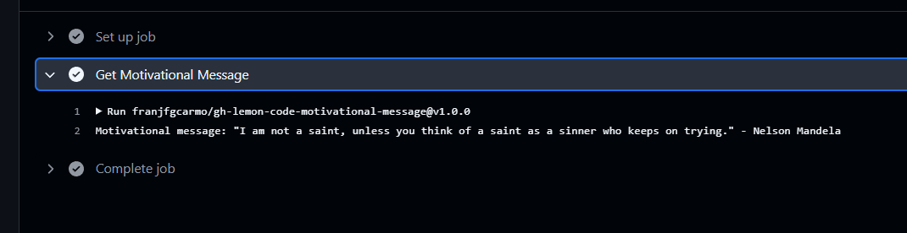

### 4. Crea una custom JavaScript Action - OPCIONAL

Crea una custom JavaScript Action que se ejecute cada vez que una `issue` tenga la etiqueta `motivate`. La acción deberá pintar por consola un mensaje motivacional. Puedes usar [esta API](https://favqs.com/api) gratuita. Puedes encontrar más información de como crear una custom JS action en [este enlace](https://docs.github.com/es/actions/creating-actions/creating-a-javascript-action).

```bash
curl https://favqs.com/api/qotd
```

### Solución.


Paso realizados:

1. Inicialización del proyecto.

```shell
# Inicializamos el proyecto de node
npm init -y 
# Instalamos los siguientes paquetes
npm i @actions/github @actions/core
```

2. Generamos la estructura de la custom action.
Link a la custom action [gh-lemon-code-motivational-message](https://github.com/franjfgcarmo/gh-lemon-code-motivational-message)

3. Creamos el tag para la primera versión.
```shell
git tag -a -m "Get motivational message. First release" v1.0.0
git push --follow-tags  
```

4. Creamos la siguiente [github action](https://github.com/franjfgcarmo/gh-lemon-code-2024/blob/main/.github/workflows/issue-motivate.yaml).

**Archivo yaml**
```yaml
name: Motivate on Label
on:
  issues:
    types: 
      - labeled

jobs:
  motivate:
    runs-on: ubuntu-latest
    steps:
      - name: Get Motivational Message
        uses: franjfgcarmo/gh-lemon-code-motivational-message@v1.0.0
```

- Dejo el link de las issues creadas para probar: [Issues](https://github.com/franjfgcarmo/gh-lemon-code-2024/issues)

- Dejo el [link](https://github.com/franjfgcarmo/gh-lemon-code-2024/actions/runs/12856299191/job/35842820842) a unos de los jobs ejecutados.
