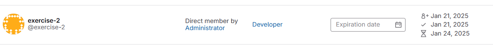

### 2. Crear un usuario nuevo y probar que no puede acceder al proyecto anteriormente creado - OBLIGATORIO

* Añadirlo con el role `guest`, comprobar que acciones puede hacer.
* Cambiar a role `reporter`, comprobar que acciones puede hacer.
* Cambiar a role `developer`, comprobar que acciones puede hacer.
* Cambiar a role `maintainer`, comprobar que acciones puede hacer.

Acciones a probar:

* Commit
* Ejecutar pipeline manualmente
* Push and pull del repo
* Merge request
* Acceder a la administración del repo

### Solución

#### Role guest.

- Commit. **Si permite**
- Push and pull.** No me ha permitido **

- Merge request. **No aparece el botón para crear pull request**
- Acceder a la administración del repo. **Sólo permite consultarlo**
- Pipeline. **No aparece la opción para lanzar una pipeline.**

#### Role reporter.

- Commit. **Si permite**
- Push and pull. **No me ha permitido** 

- Merge request. **No aparece el botón para crear pull request**
- Acceder a la administración del repo. **Sólo permite consultarlo**
- Pipeline. **No aparece la opción para lanzar una pipeline.**

#### Role developer.

 - Commit. **Si permite**
 - Push and pull del repo. **Si permite**

 
 

 - Ejecutar pipeline manualmente. **Se puede lanzar una nueva pipeline**
 - Merge request. **Se puede crear.**
 - Acceder a la administración del repo.**Sólo permite consultarlo**

#### Role maintainer.

 - Commit
 - Push and pull del repo
 

- Ejecutar pipeline manualmente. **Se puede lanzar**
- Merge request. **Se pueden crear pull request**
- Acceder a la administración del repo. **Permite agregar usuario y también acceder a los Setting**
