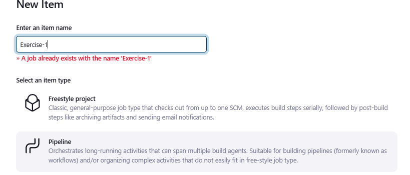
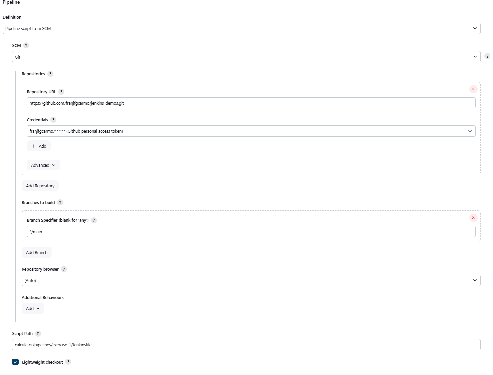
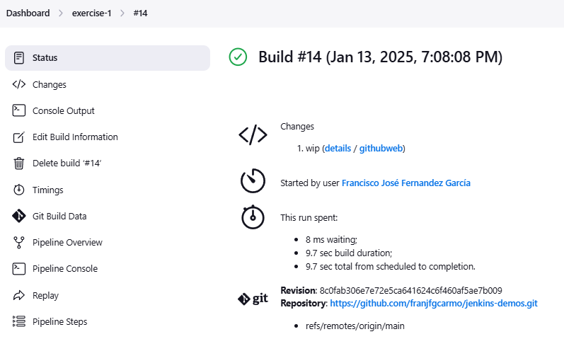

### 1. CI/CD de una Java + Gradle - OBLIGATORIO

En el directorio raíz de este [código fuente](https://github.com/Lemoncode/bootcamp-devops-lemoncode/tree/master/03-cd/exercises/jenkins-resources), crea un `Jenkinsfile` que contenga una pipeline declarativa con los siguientes stages:

* **Checkout**. Descarga de código desde un repositorio remoto, preferentemente utiliza GitHub
* **Compile**. Compilar el código fuente utilizando `gradlew compileJava`
* **Unit Tests**. Ejecutar los test unitarios utilizando `gradlew test`

Para ejecutar Jenkins en local y tener las dependencias necesarias disponibles podemos contruir una imagen a partir de [este Dockerfile](https://github.com/Lemoncode/bootcamp-devops-lemoncode/blob/master/03-cd/exercises/jenkins-resources/gradle.Dockerfile)

### Solución
#### 1. Generación de la imagen y el contenedor de docker para gradle.

 ```shell
docker build -t jenkins-gradle -f gradle.Dockerfile .

docker run -d -p 8081:8080  -p 50001:50000 --name jenking-gradle jenkins-gradle

docker exec -it be58681729bc /bin/bash 

cat /var/jenkins_home/secrets/initialAdminPassword
 ```

#### 2. Configuramos el repositorio de Github para que Jenkins se conecte y pueda ejecutar la pipeline.

>Manage  Jenking > Credential>


- [Repositorio de github con el código fuente y las pipelines](https://github.com/franjfgcarmo/jenkins-demos/tree/main/calculator)
- [Archivo de Jenkinsfile de ejercicio 1](https://github.com/franjfgcarmo/jenkins-demos/blob/main/calculator/pipelines/exercise-1/Jenkinsfile)

#### 3. Creación de la pipeline desde Jenkins




#### 4. Ejecución de la pipeline
[Se adjunto output de la pipeline](resourses/s_14.txt)


  
  