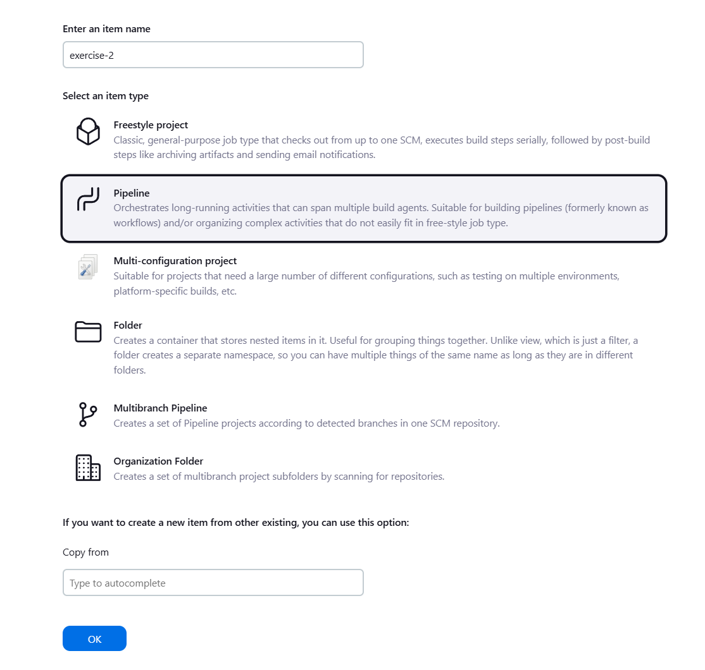
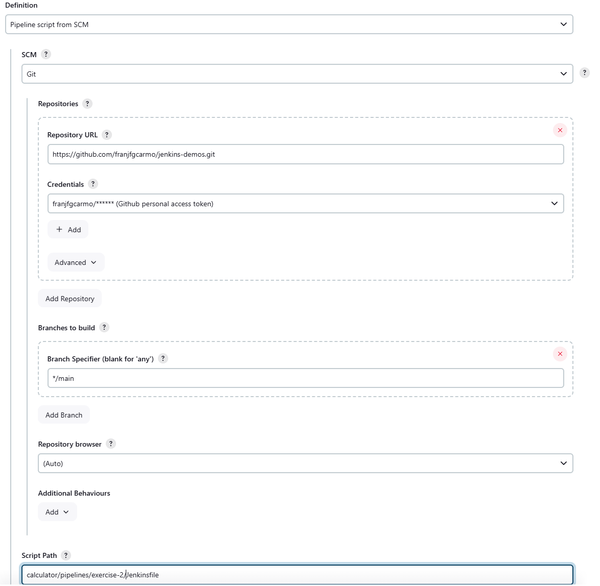

### 2. Modificar la pipeline para que utilice la imagen Docker de Gradle como build runner - OBLIGATORIO

* Utilizar Docker in Docker a la hora de levantar Jenkins para realizar este ejercicio
* Como plugins deben estar instalados `Docker` y `Docker Pipeline`
* Usar la imagen de Docker `gradle:6.6.1-jre14-openj9`

### Solución
todo: Añadir link y output

