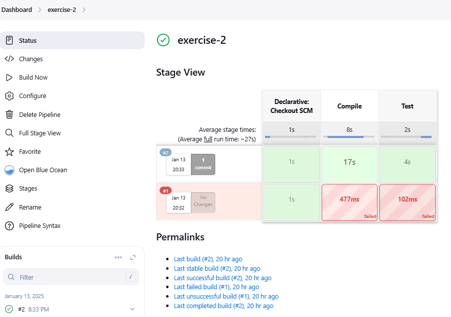

### 2. Modificar la pipeline para que utilice la imagen Docker de Gradle como build runner - OBLIGATORIO

* Utilizar Docker in Docker a la hora de levantar Jenkins para realizar este ejercicio
* Como plugins deben estar instalados `Docker` y `Docker Pipeline`
* Usar la imagen de Docker `gradle:6.6.1-jre14-openj9`

### Solución
#### 1. Generación de contenedor a través de docker compose.

Utilizamos [el docker compose para la instalación de Jenkins con Docker in Docker](https://github.com/Lemoncode/bootcamp-devops-lemoncode/blob/master/03-cd/01-jenkins/00-instalando-jenkins/docker-compose.yml).

#### 2. Configuramos el repositorio de Github para que Jenkins se conecte y pueda ejecutar la pipeline.

>Manage  Jenking > Credential>

- [Repositorio de github con el código fuente y las pipelines](https://github.com/franjfgcarmo/jenkins-demos/tree/main/calculator)
- [Archivo de Jenkinsfile de ejercicio 1](https://github.com/franjfgcarmo/jenkins-demos/blob/main/calculator/pipelines/exercise-2/Jenkinsfile)

#### 3. Creación de la pipeline desde Jenkins

#### 4. Ejecución de la pipeline
[Se adjunto output de la pipeline](resourses/s#2.txt)

